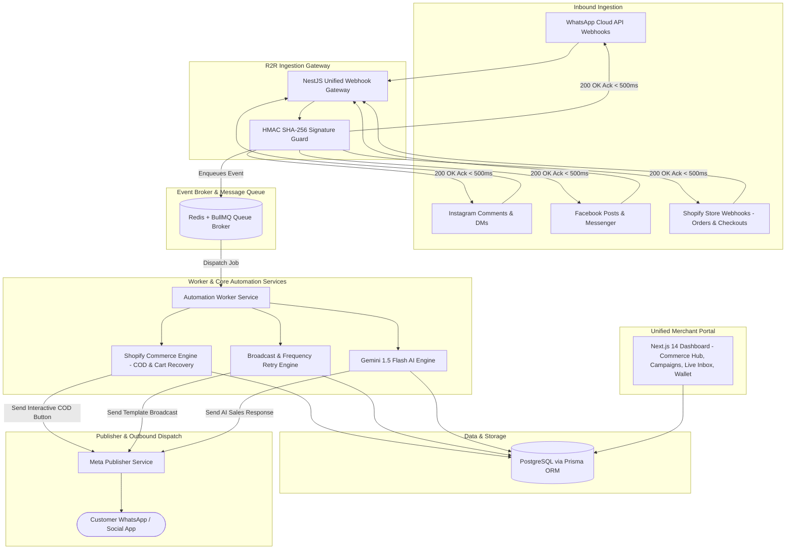

# R2R (Reel2Real) - Omnichannel AI Sales & WhatsApp Business API Commerce Platform
## Comprehensive Product Blueprint, System Architecture & AiSensy-Benchmark Upgrade

---

## 1. Executive Summary & Market Positioning

**Reel2Real (R2R)** is an enterprise-grade, omnichannel AI sales, customer engagement, and WhatsApp Business API commerce platform built for D2C brands, social sellers, e-commerce stores, performance marketers, and multi-brand agencies.

While originally inspired by social automation tools like **Groaa**, R2R is upgraded with full-stack **WhatsApp Business API (Cloud API)** capabilities benchmarked directly against market leaders like **AiSensy, WATI, and Interakt**. 

### The Real Market Need (Based on AiSensy 15-Reel Live Instagram Data Analysis):
1. **COD Confirmation & RTO Reduction (The #1 D2C Pain Point):** In India, 60–70% of e-commerce orders are Cash on Delivery (COD), with return-to-origin (RTO) rates as high as 30–40%. Automated interactive WhatsApp verification (`[Confirm Order]` / `[Cancel Order]`) eliminates fake orders before dispatch.
2. **Abandoned Cart Recovery (High ROI):** Over 70% of shoppers drop off at checkout. A 3-tier automated sequence (15m, 6h, 24h) with dynamic discount codes recovers 20–30% of abandoned revenue.
3. **Click-to-WhatsApp Ads Funnel:** High drop-offs on traditional ad landing pages are eliminated by driving traffic directly from Instagram/Facebook ads into a WhatsApp conversational sales flow.
4. **Frequency Capping & Campaign Deliverability:** Meta limits promotional messages per user. Businesses lose reach when broadcasts fail; an intelligent **Frequency Capping Auto-Retry Engine** reschedules undelivered messages with alternate approved templates.
5. **The "AiSensy Penalty" (Market Opportunity):** Growing businesses are frustrated with competitor pricing models charging **₹750/agent seat extra**. R2R offers **Unlimited Agent Seats at ₹0 extra**, making it the obvious choice for teams.

---

## 2. Competitive Benchmark: AiSensy vs. R2R Platform

| Feature / Dimension | AiSensy Platform | Reel2Real (R2R Upgraded) |
| :--- | :--- | :--- |
| **Channels** | WhatsApp Business API primarily | **Omnichannel: WhatsApp Business API + Instagram (Comments/DMs) + Facebook (Page/Messenger)** |
| **Agent Pricing** | **₹750 / agent / month** beyond basic seats | **Unlimited Team Agents Included (₹0 extra seat fee)** |
| **Shopify / D2C Engine** | Basic notification app | **Deep Native Automations:** 1-Click COD Confirmation, 3-tier Abandoned Cart Recovery, Order Tracking & Review Collection |
| **Broadcast Delivery** | Basic retry campaign feature | **Intelligent Frequency-Capping Auto-Retry:** Automatically retries undelivered broadcasts across approved template variations |
| **Conversation Markup** | High markup added on Meta conversation rates | **Transparent Wallet Billing:** Direct pass-through of Meta conversation rates + minimal flat software subscription |
| **AI Intelligence** | Rule-based or separate add-on bot builder | **Native Google Gemini 1.5 Flash:** Multilingual (Hinglish/Hindi/English) conversational commerce, post-to-product mapping & lead qualification |
| **Human Handoff** | Basic ticket inbox | **Sentiment Guardrail Inbox:** Instant escalation on negative/refund comments with real-time WebSocket agent takeover |

---

## 3. High-Level Omnichannel System Architecture

---

## 4. Core Product Modules & Functional Specifications

### 4.1 Shopify & E-Commerce Automation Engine
- **1-Click COD Confirmation:**
  - On Shopify `orders/create` (where `gateway == 'cash_on_delivery'`), immediately dispatch a WhatsApp interactive message with two quick-reply buttons: `[Confirm Order (COD)]` and `[Cancel Order]`.
  - When customer taps `Confirm Order`, WhatsApp webhook triggers an automated tag update on Shopify (`COD-Confirmed`) and notifies fulfillment.
  - When customer taps `Cancel Order`, automatically tag order (`COD-Cancelled`), restock inventory, and avoid shipping/RTO costs.
- **3-Tier Abandoned Cart Recovery:**
  - Stage 1 (15 minutes): Friendly reminder with items summary and 1-click checkout button.
  - Stage 2 (6 hours): Urgency alert + 5% limited-time discount coupon code.
  - Stage 3 (24 hours): Final call with 10% discount before cart expiration.
- **Order Lifecycle Notifications:**
  - Order Confirmed $\rightarrow$ Shipped (with live tracking URL) $\rightarrow$ Out for Delivery $\rightarrow$ Delivered $\rightarrow$ Automated Review Request.

### 4.2 WhatsApp Broadcast & Frequency Capping Retry Engine
- **Contact Segmentation & CSV Import:** Filter by tags, recent purchasers, inactive leads, or custom attributes.
- **Template Management:** Create, validate, and preview Meta-approved templates (Marketing, Utility, Authentication) with dynamic variables (`{{1}}`, `{{2}}`).
- **Frequency Capping Auto-Retry:** When Meta throttles marketing messages to saturated users, R2R flags the undelivered messages and automatically schedules retries using alternate pre-approved utility/marketing template variations at configured intervals.
- **Campaign Analytics:** Real-time funnel tracking: Sent $\rightarrow$ Delivered $\rightarrow$ Read $\rightarrow$ Clicked/Replied.

### 4.3 Unlimited-Seat Shared Team Inbox
- Single WhatsApp number handled concurrently by unlimited customer support agents.
- Real-time conversation streaming via WebSockets.
- Agent assignment, ticket resolution statuses (`OPEN`, `PENDING`, `RESOLVED`), internal notes, and canned quick-replies.
- **Zero seat fees** (no ₹750/agent penalty like AiSensy).

### 4.4 Click-to-WhatsApp Ads & Lead Qualification Funnel
- Track leads originating from Meta Click-to-WhatsApp (CTWA) ads.
- Automated AI qualification questions (Name, requirement, budget, timeline).
- Qualified leads instantly assigned to human sales reps; cold leads enrolled into nurture broadcasts.

### 4.5 Commercial Multi-Tenant Architecture & Transparent Wallet
- **Meta Embedded Signup:** Allows business clients to onboard their own WhatsApp Business Account (WABA) and phone numbers with 1-click Facebook Login.
- **Prepaid Wallet & Ledger:** Clients maintain a prepaid wallet (recharged via Razorpay/Stripe).
  - Exact Meta conversation fees (Marketing, Utility, Service) deducted transparently with zero hidden markups.
  - Platform subscription charged monthly or annually.

---

## 5. Implementation Roadmap

### Phase 1: Hardening, Core Database & Meta Publisher (Current)
Wave 1 of the reconciled plan: webhook HMAC + loop guards land **before** Meta App publish.
- [x] Market research and competitor benchmark (AiSensy 15-Reel analysis).
- [x] Comprehensive blueprint and system architecture finalized.
- [x] Expand Prisma schema: `Contact`, `WhatsAppTemplate`, `BroadcastCampaign`, `ShopifyStore`, `EcommerceOrder`, `AbandonedCart`, `Wallet`, `WalletTransaction`, plus `ProcessedWebhookEvent` / `WhatsAppMessageStatus`.
- [x] Extend `MetaPublisherService` with interactive button messages, template messages, and checkout CTA links.
- [x] Meta + Shopify HMAC on raw body, echo/self-comment guards, idempotency, fail-closed secrets.
- [ ] Run `prisma migrate` against the live database and seed WhatsApp/Shopify credentials via env.

### Phase 2: Shopify Commerce Automation Module
- [x] Implement `ShopifyModule`: Webhook endpoints for `orders/create`, `checkouts/create`, and `checkouts/update` (HMAC required).
- [x] Implement COD verification flow with interactive buttons (requires a mapped `ShopifyStore` + WhatsApp `Channel`).
- [x] Handle WhatsApp webhook button callbacks (`COD_CONFIRM_*` and `COD_CANCEL_*`) with Shopify tag sync + restock on cancel.
- [x] Build 3-stage abandoned cart scheduler (15m / 6h / 24h).
- [ ] Point Shopify admin webhooks at production HTTPS and confirm a live COD round-trip.

### Phase 3: Broadcast & Campaign Manager
- [ ] Build broadcast campaign runner with Redis/BullMQ queueing and rate-limiting.
- [ ] Implement Frequency Capping Auto-Retry mechanism.
- [ ] Contact list management and CSV ingestion service.

### Phase 4: Frontend Merchant Dashboard Upgrades (`h:\ReelToRealAutoWebapp`)
- [ ] WhatsApp Commerce Hub: COD Confirmation monitor, RTO protection savings metrics, Abandoned Cart recovery controls.
- [ ] WhatsApp Broadcast & Campaigns Tab: Campaign scheduler, Meta templates viewer, audience picker.
- [ ] Unlimited-Seat Shared Team Inbox: Live conversation view with agent assignment.
- [x] Login-gated console: Facebook / Instagram / WhatsApp Meta OAuth, connect extra channels, inbox split by channel.
- [x] Single OAuth redirect: `{PUBLIC_BASE_URL}/auth/meta/callback` (provider lives in `state`).
- [ ] Transparent Wallet & Billing: Real-time balance, conversation pricing breakdown, 1-click recharge.

### Phase 5: Meta Embedded Signup & Commercial Agency Launch
- [ ] Integrate Meta Embedded Signup SDK for client self-onboarding.
- [ ] Prepare Meta App Review compliance documentation (`whatsapp_business_management`, `whatsapp_business_messaging`).
- [ ] End-to-end sandbox simulation and client launch.
