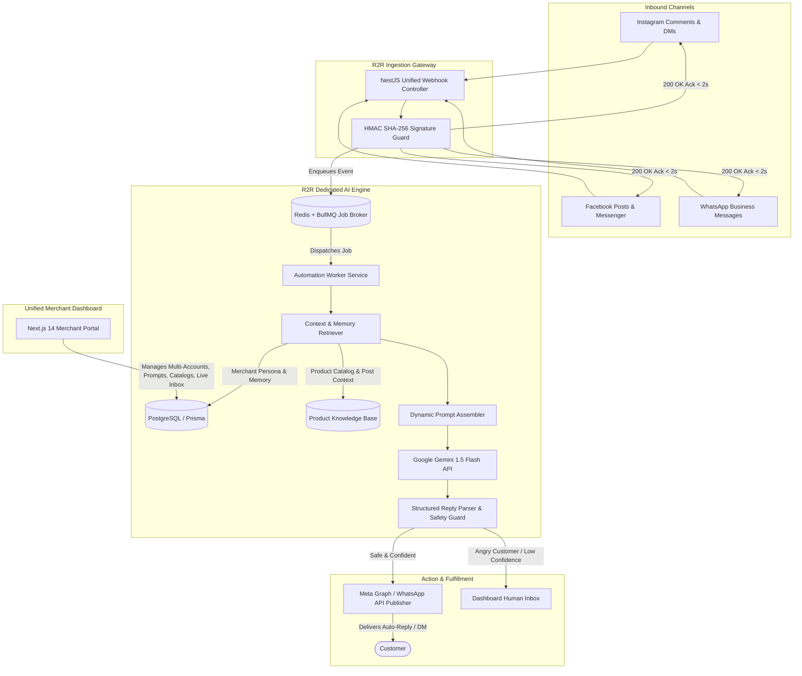

# R2R (Reel2Real) - Social AI Automation & Commerce Platform
## Comprehensive Product Blueprint, System Architecture & Groaa-Benchmark Upgrade

---

## 1. Executive Summary & Market Positioning

**Reel2Real (R2R)** is an enterprise-grade, omnichannel AI sales and customer engagement platform built for D2C brands, social sellers, creators, and multi-brand agencies. 

Inspired by platforms like **Groaa**, Reel2Real takes social automation to the next level by supporting **Omnichannel Engagement (Instagram + Facebook + WhatsApp)**, **Multi-Account Management under a Single User**, and a dedicated **Personalized AI Engine** that grounds every conversation in real-time product catalogs, pricing, and brand personality.

### The Problem R2R Solves:
1. **Lost Sales in Comments & DMs:** 70% of potential buyers drop off if their  Price?, Size M available?, or Order link queries aren't answered within 5 minutes.
2. **Fragmented Channels:** Brands struggle to juggle Instagram comments, Instagram DMs, Facebook Page feeds, and WhatsApp inquiries across multiple tools.
3. **Robotic, Generic Bots:** Traditional flow-based chatbots fail on natural language, cannot understand Hinglish/local slang, and hallucinate or frustrate customers.

---

## 2. Groaa Analysis & The Reel2Real Upgraded Advantage

| Feature / Dimension | Groaa Platform | Reel2Real (R2R Upgraded) |
| :--- | :--- | :--- |
| **Channels Supported** | Primarily Instagram DMs + Shopify | **Instagram (Comments + DMs) + Facebook (Posts + Messenger) + WhatsApp Business API** |
| **Account Architecture** | 1 brand per connection | **Single User $\rightarrow$ Multiple Brands, Multiple FB Pages, Multiple IG Accounts & WhatsApp** |
| **Comment-to-DM Pipeline** | Limited public comment conversion | **Auto-reply to public comment + Auto-trigger private DM** with trackable checkout link |
| **AI Personalization** | English/General store description | **Dedicated Backend AI Engine:** Post-to-Product mapping, custom brand persona (formal, friendly, Gen-Z, Hinglish), and fine-tuned product memory |
| **Product Grounding** | Shopify store sync | **Multi-Platform Sync:** Shopify, WooCommerce, Custom CSV/Excel catalogs, or in-dashboard Product Builder |
| **Testing & Safety** | Shadow Mode (DM preview) | **Interactive Simulation Sandbox:** Test both comments and DMs live in dashboard before going live |
| **Human Handoff** | Basic notification | **Sentiment Guardrail:** Negative/Complaint/Refund detection flags REQUIRES_HUMAN_ATTENTION with live agent chat takeover |

---

## 3. High-Level Omnichannel Architecture

---

## 4. Multi-Tenant & Multi-Account Architecture

A single Reel2Real account owner (Merchant or Agency) can connect and manage multiple assets:

`	ext
User Account (e.g., merchant@brand.com)
  ├── Organization / Brand A
  │     ├── Instagram Account #1 (@brand_apparel)
  │     ├── Facebook Page #1 (Brand Apparel Official)
  │     └── WhatsApp Business Number (+91-9876543210)
  │     └── Product Catalog A (Apparel, Sizing, Prices)
  │     └── Brand Persona: Trendy Gen-Z Hinglish friendly
  │
  └── Organization / Brand B
        ├── Instagram Account #2 (@brand_footwear)
        ├── Facebook Page #2 (Brand Footwear)
        └── Product Catalog B (Shoes, Size Chart)
        └── Brand Persona: Professional Premium Direct
`

---

## 5. Dedicated Backend AI Engine (Reel2Real AI Core)

The AI engine in the backend is a standalone, stateful intelligence pipeline:

### 1. Post-to-Product Mapping (Visual & Text Context)
- When an Instagram Reel or Post is created, the merchant can tag the specific product from their catalog (e.g., Post ID 1792... = Royal Silk Kurta SKU-102 Price: ₹1,499).
- When a user comments Price please on that specific reel, the AI knows *exactly* which product the user is referring to without asking Which product?.

### 2. Merchant Personalized Memory & Rules
- **Brand Tone:** Formal, Casual, Friendly, Playful, Emojis level (None, Moderate, High).
- **Language Mode:** Pure English, Hinglish, Hindi, or Auto-detect user language.
- **Conversion Strategy:**
  - *Public Comment:* Short, engaging reply (e.g., Hey! Sent you the complete details and exclusive discount link in your DM! 🛍️✨).
  - *Private DM:* Sends direct product card with images, key specs, sizes available, and 1-click checkout URL.

### 3. Safety Guardrails & Human Handoff
- **Negative Sentiment Detection:** If comment contains words like fake, scam, damaged, refund, cheaters:
  - Auto-reply is suppressed or set to a respectful de-escalation template.
  - An instant alert is dispatched to the dashboard under **Urgent Human Attention**.
- **Out of Stock Awareness:** If inventory = 0, the AI states: *Currently out of stock in Size L but restocking next Tuesday! Drop your email/phone to get notified.*

---

## 6. End-to-End Workflow

### Step 1: Merchant Onboarding & Unified Auth
1. Merchant signs up on Reel2Real dashboard via Google / Email / Facebook.
2. Connects Facebook / Instagram using **Facebook Login for Business**.
3. (Optional) Connects WhatsApp Cloud API credentials.
4. Connects Product Store (Shopify API / WooCommerce / CSV Upload).
5. Configures Brand Persona in 3 clicks (or tests in **Shadow Mode**).

### Step 2: Inbound Webhook Handling
1. Customer comments on IG/FB post or sends a DM / WhatsApp message.
2. Webhook controller receives the event payload:
   - Validates HMAC SHA-256 signature (X-Hub-Signature-256).
   - Responds HTTP 200 OK in < 500ms.
   - Pushes event to BullMQ queue with idempotency check (to avoid duplicate processing).

### Step 3: AI Processing & Response Generation
1. Worker grabs job from BullMQ.
2. Worker checks:
   - Is sender the account itself? $\rightarrow$ Ignore.
   - Has this comment already been replied to? $\rightarrow$ Ignore.
3. Retrieves Post Context + Product Info + Brand Persona.
4. Invokes Google Gemini 1.5 Flash with structured system prompt.
5. Gemini generates reply payload (Public comment text + Private DM text).

### Step 4: Multi-Channel Dispatch
1. Post reply to comment: POST /{comment-id}/replies
2. Send private DM (if configured): POST /{page-id}/messages
3. Log interaction in database with latency, token cost, and conversion tracking.

---

## 7. Tech Stack Breakdown

| Subsystem | Technology | Justification |
| :--- | :--- | :--- |
| **Backend Framework** | **NestJS** (Node.js + TypeScript) | Modular architecture (AuthModule, WebhookModule, AiModule, QueueModule) |
| **AI Intelligence** | **Google Gemini 1.5 Flash** | Sub-second latency, cheap token economics, multilingual (Hinglish/Hindi/English) |
| **Queue & Cache** | **Redis + BullMQ** | Handles viral traffic spikes, Meta API rate limits, deduplication |
| **Database & ORM** | **PostgreSQL + Prisma ORM** | Multi-tenant schema, encrypted token storage, relational catalog mapping |
| **Frontend / Dashboard** | **Next.js 14 + Tailwind CSS + shadcn/ui** | Real-time analytics, live chat inbox, catalog editor, Shadow Mode simulator |
| **Tunneling / Deployment** | **Static IP + Nginx / Cloudflare (or ngrok for dev)** | Secure, compliant HTTPS endpoints required by Meta & WhatsApp |

---

## 8. Implementation Phases & Roadmap

### Phase 1: Webhook Infrastructure & Meta Handshake (Current Focus)
- [x] Architecture & Groaa-benchmark blueprint finalized.
- [ ] Implement GET /webhook verification endpoint in NestJS.
- [ ] Implement POST /webhook with HMAC SHA-256 signature verification.
- [ ] Complete Meta Developer App Webhook verification with ngrok / static domain.

### Phase 2: AI Engine Core & Prompt Engineering
- [ ] Integrate Google Gemini 1.5 Flash SDK (@google/genai or @google/generative-ai).
- [ ] Build Prompt Orchestrator (Brand Persona + Product Grounding + Few-Shot Examples).
- [ ] Build Shadow Mode (Sandbox simulation endpoint to test AI responses).

### Phase 3: Meta Graph API & Automated Response Publisher
- [ ] Graph API Service: Post comment replies (POST /{comment-id}/replies).
- [ ] Graph API Service: Send private DMs (POST /{page-id}/messages).
- [ ] WhatsApp Cloud API Service: Auto-respond to WhatsApp business inquiries.
- [ ] BullMQ queue integration for rate-limiting and retry logic.

### Phase 4: Multi-Tenant Architecture & Facebook Login for Business
- [ ] OAuth 2.0 flow: Exchange short-lived token to Long-Lived Token & Page Tokens.
- [ ] Database Schema (Prisma): Multi-tenant User $\rightarrow$ Multiple Organizations $\rightarrow$ Multiple Accounts.
- [ ] Encrypted token vault (AES-256-GCM) for storing merchant access tokens.

### Phase 5: Merchant Dashboard & Catalog Integration
- [ ] Next.js 14 Dashboard: Account switcher, live interaction logs.
- [ ] Product Catalog Manager: CSV upload + Shopify API connector.
- [ ] Post-to-Product tagging UI.
- [ ] Human-in-the-loop escalation inbox.

### Phase 6: Meta App Review & Production Launch
- [ ] Complete Meta Business Verification.
- [ ] Record compliance screencast for instagram_manage_comments, pages_manage_posts, and whatsapp_business_messaging.
- [ ] Switch app from Development to Live mode.
